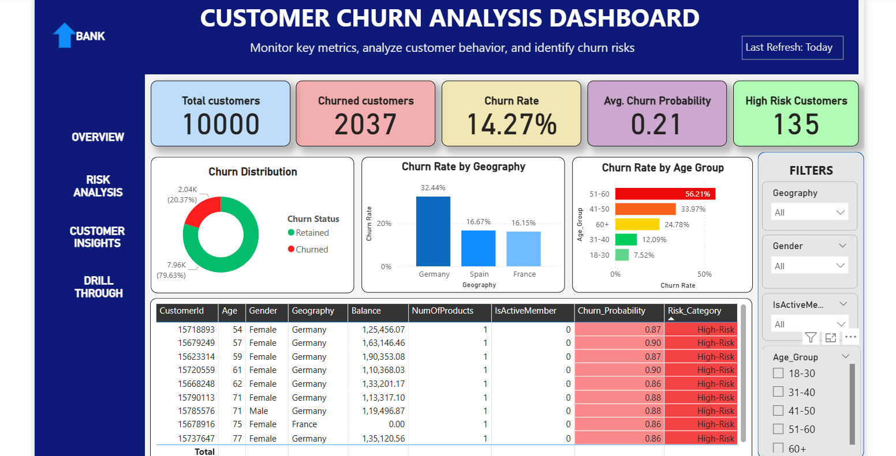

# Customer Churn Analysis

## 📌 Objective
To analyze customer data and identify key factors contributing to churn.

## 🛠️ Tools Used
- Python (Pandas, Seaborn)
- SQL
- Power BI

## 📊 Project Workflow
1. Data Cleaning and Preprocessing
2. Exploratory Data Analysis (EDA)
3. SQL-based Data Analysis
4. Dashboard Creation in Power BI

## 🔍 Key Insights
- Customers with month-to-month contracts have the highest churn
- High monthly charges are linked with higher churn
- Customers with low tenure are more likely to churn

## 📁 Project Structure
- Data
- Python Notebook
- SQL Queries
- Power BI Dashboard

## 📷 Dashboard Preview

